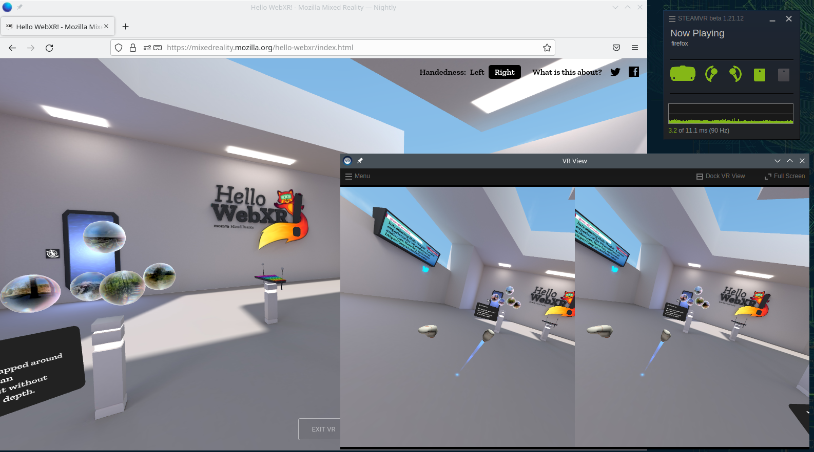

# Firefox
This folder contains various patch files for firefox to allow WebXR content to work under Linux. It is more a hack than a proper implementation, and is only tested under X11, using a Valve Index as HMD.



# How to compile
In order to apply and compile this patch, it's important that you are able to compile Firefox yourself. For this follow the steps over at: https://firefox-source-docs.mozilla.org/setup/linux_build.html

> **Note:** don't make use of 'Artifact Mode' as the patch modifies the C++ code

Once you have the Firefox code base locally, apply **one** of the patch files. The following command is for the `webxr-linux-dmabuf.patch` file (recommended):

```
hg patch --no-commit path/to/webxr-linux-dmabuf.patch
```

Once applied, build using `./mach build` and if everything goes well, you should now have a built version with WebXR support. Run it using `./mach run`. There are some settings you will have to enable in `about:config`:
| Preference name | Value |
|-----------------|-------|
| `dom.vr.enabled` | true |
| `dom.vr.openvr.enabled` | true |
| `dom.vr.webxr.enabled`  | true |

After configuring the above preferences, be sure to restart the firefox instance, as some of these only take effect on startup of Firefox.

You are now ready to go and visit any WebXR experience on the web. Examples:
 * https://mixedreality.mozilla.org/hello-webxr/
 * https://immersive-web.github.io/webxr-samples/report/

# How it works
Firefox already contains all the relevant logic for handling the JS side of the WebXR specification and supports the OpenVR (Steam specific) runtime. Since SteamVR also works under Linux, the only missing part is actually submitting the frame data to the VRCompositor.

## The DMABUF version (`webxr-linux-dmabuf.patch`)
This patch let's the WebGL rendering use EGL and creates its own (E)GL context on the compositor side. The textures are shared between the two using DMABuf. In theory DMABuf also allows for it to take place over IPC, but the way this patch is written, that isn't possible (yet).

## The GLX version (`webxr-linux-glx.patch`)
The biggest drawback of the initial version was the need to copy the framebuffer contents to RAM and reupload it in a different GL context. This new patch actually makes use of the fact that Firefox does support using GLX for WebGL rendering. This means that the framebuffer textures it produces can be directly consumed by OpenVR. This removes the bottleneck of the initial version and grealy improves performance.

With this patch practically all WebXR experiences performed at a stable 90fps at >100% render resolution on my machine.

> **Note:** when using the `webxr-linux-glx.patch` it's important that EGL isn't used. So in addition to the preferences mentioned above, the `gfx.x11-egl.force-disabled` preference should also be set to `true`.


## The initial version (`webxr-linux.patch`)
The initial version let Firefox use EGL (OpenGL ES 2.0) for WebGL rendering. OpenVR doesn't support this, but only supports 'Desktop GL'.

To workaround this, the `webxr-linux.patch` basically makes use of `glReadPixels` to load the raw pixel data from the OpenGL ES framebuffer and reuploads it as a new texture in a GLX context _every frame_. As a result, this solution isn't very performant, but when reducing the render resolution it's possible to hit 90HZ with relative ease.